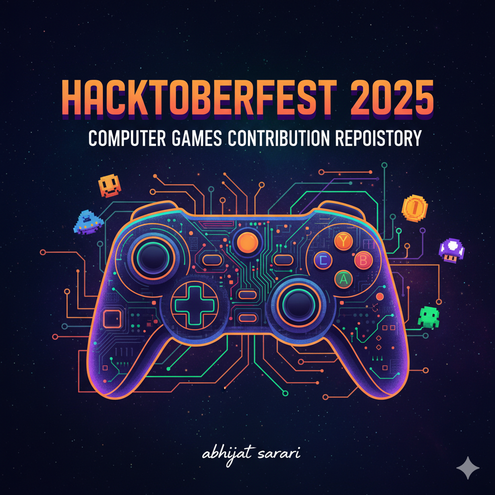
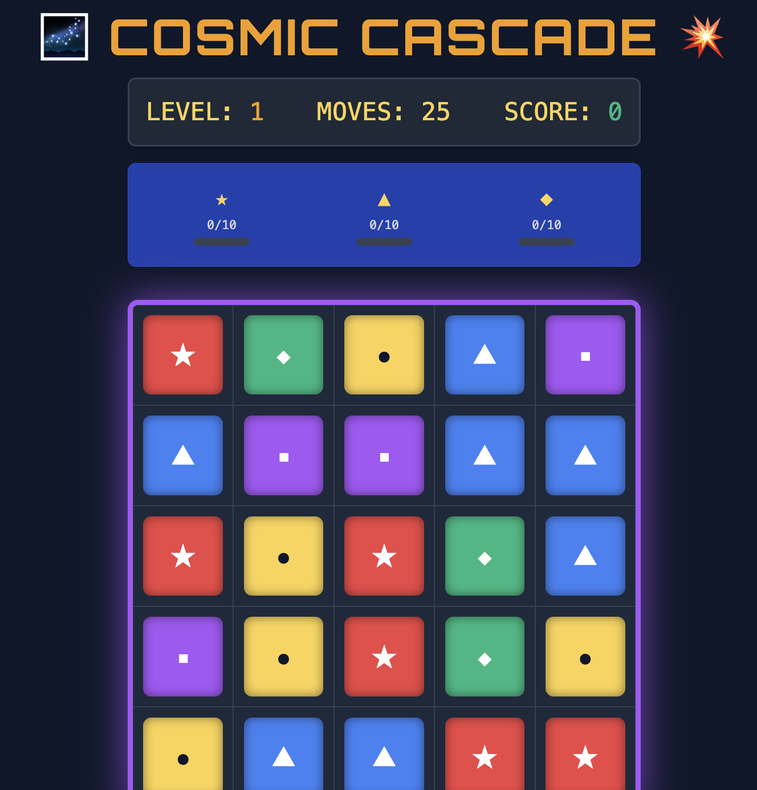
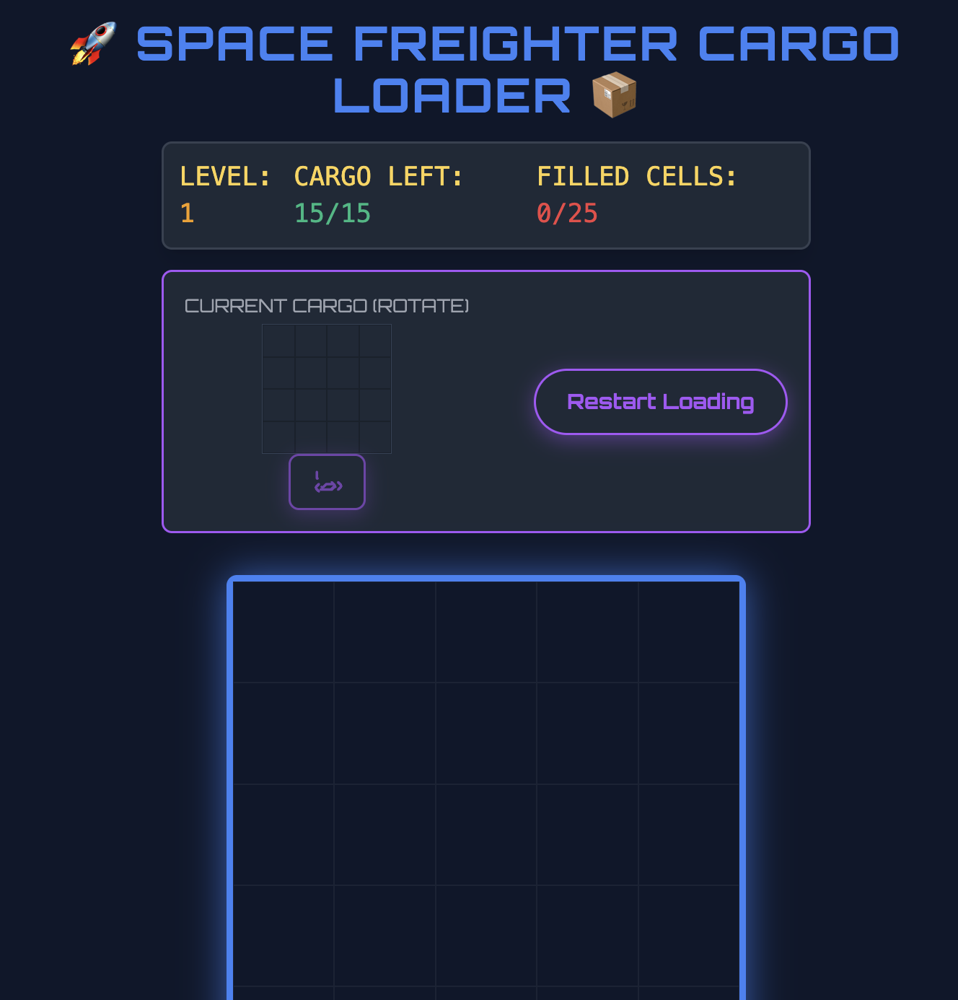
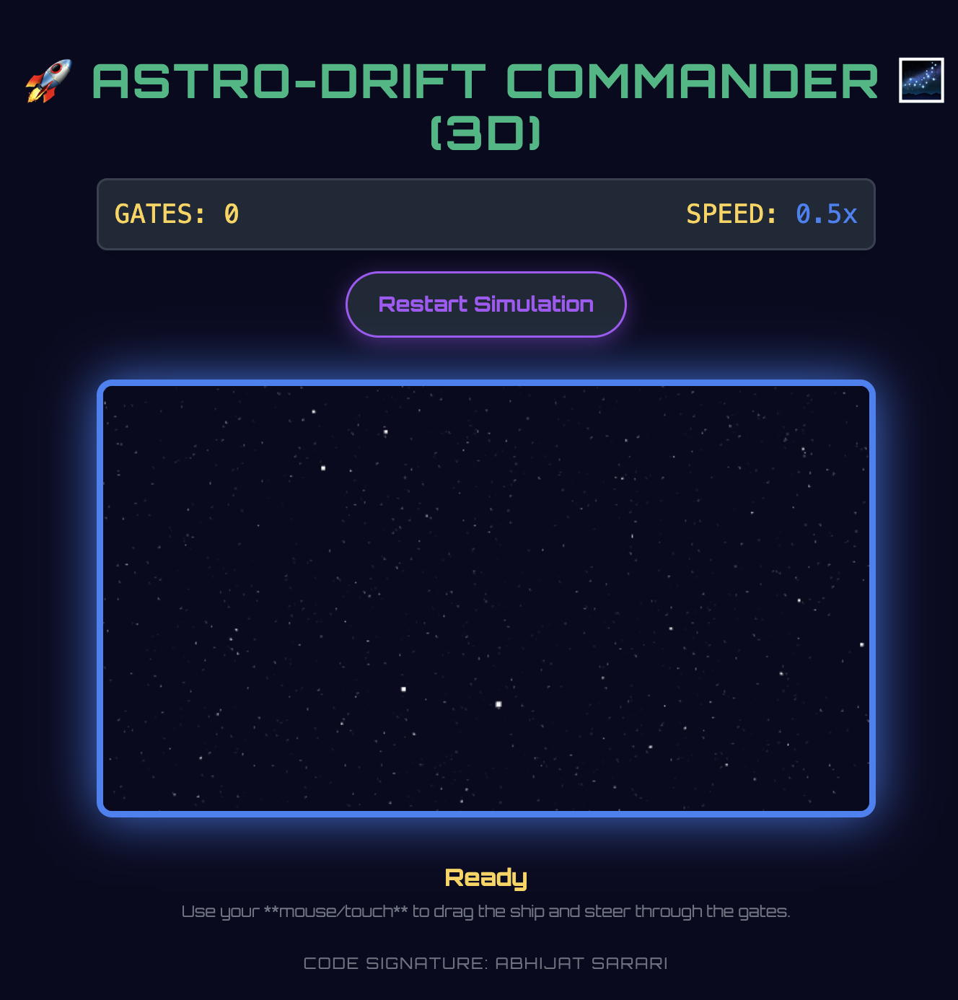
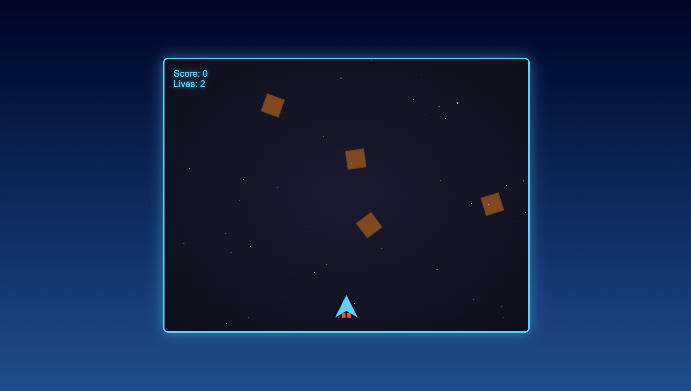
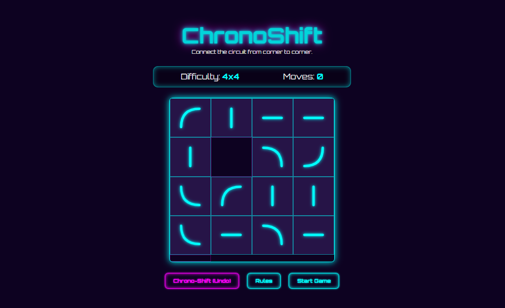
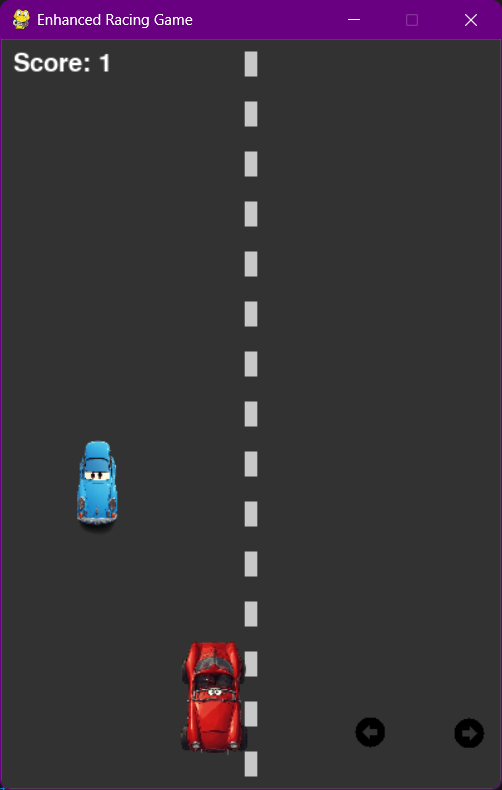
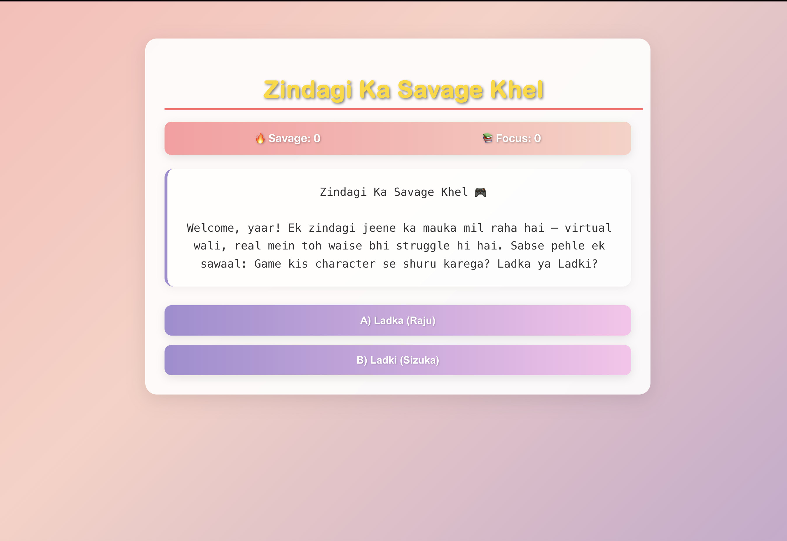
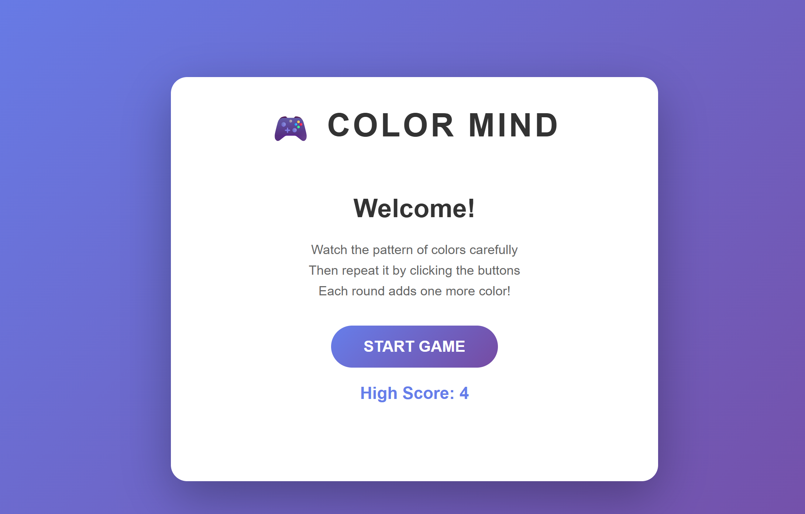

<!-- Festive Hacktoberfest SVG Banner -->
<p align="center">
  
</p>

# 🎮 Hacktoberfest 2025: Computer Games Contribution Repository 🎉

<!-- Badges -->
<p align="center">
  <a href="https://hacktoberfest.com/"></a>
  <a href="CONTRIBUTING.md"></a>
  <a href="LICENSE"></a>
  <a href="https://github.com/ABHIJATSARARI/hacktoberfest-2025-computer-games/issues"></a>
</p>

---

## ✨ Welcome Hacktoberfest Game Devs!

Celebrate open source and gaming!  
🎯 Make your mark by building and sharing computer games.  
🚀 All languages and levels welcome.

---

<p align="center">
  
</p>


## 🖼️ Featured Project Images & Demos

<p align="center">
  
</p>

> Want your game featured?  
> Add a screenshot (PNG/JPG/GIF) in your game folder and mention it in your PR!  
> **Repo maintainers will showcase the best games here!**

---

## 🕹️ Community Game Carousel

> **Contributors:** Add your game image to `/assets/carousel/` and it will be featured below!
> name the image files like sample-game-1.png........ name it the next no whatever display inside folder last file

<p align="center">
  <!-- Carousel placeholder: Add more images as contributors upload them! -->
  
  
  
  
  
  
  
  
</p>

---

## 💬 Get Involved

- [GitHub Discussions](https://github.com/ABHIJATSARARI/hacktoberfest-2025-computer-games/discussions)
- [Open an Issue](https://github.com/ABHIJATSARARI/hacktoberfest-2025-computer-games/issues)
- [Join our Community Discord](#) <!-- Add link if available -->

---

## 🏆 Hall of Fame: Featured Contributors

| Avatar | Contributor | Game | Screenshot | Description |
|--------|-------------|------|------------|-------------|
|  | [@Sumitvi](https://github.com/Sumitvi) | ChronoShift |  | JavaScript Game ChronoShift |
|  | [@Hariksh](https://github.com/Hariksh) | Space Shooter |  | Space Shooter Game |
|  | [@NothingADSR123](https://github.com/NothingADSR123) | Car Game |  | Car Game |
|  | [@NothingADSR123](https://github.com/Uday-Choudhary) |  True Story Game |  |  True Story Game |

---

## 📝 How to Get Started

1. **Fork** this repo and add your game!
2. **Read** [CONTRIBUTING.md](CONTRIBUTING.md) for guidelines.
3. **Check** issues labeled `hacktoberfest` for contribution ideas.
4. **Showcase** your creativity and help grow the community!
5. **Need help?** See our [📚 Complete Setup Guide](SETUP_GUIDE.md) for detailed instructions!

---

## 🎮 Featured Games

### Python Games 🐍

#### Snake Game
A classic snake game with smooth controls and score tracking.
- **Location**: `python/snake_game/`
- **Run**: `python snake_game.py`
- **Features**: Pygame graphics, grid-based movement, wrap-around edges
- **[View Documentation](python/snake_game/README.md)**

#### Tic-Tac-Toe
Terminal-based Tic-Tac-Toe with AI opponent and multiple difficulty levels.
- **Location**: `python/tic_tac_toe/`
- **Run**: `python tic_tac_toe.py`
- **Features**: Player vs Player, Smart AI, 3 difficulty levels
- **[View Documentation](python/tic_tac_toe/README.md)**

#### Racing Game
Exciting car racing game where you dodge obstacles.
- **Location**: `python/racing_game/`
- **Run**: `python racing_game.py`
- **[View Documentation](python/racing_game/README.md)**

### JavaScript Games 🎯

#### Pong Game
Classic Pong arcade game in your browser with AI opponent.
- **Location**: `javascript/pong_game/`
- **Run**: Open `pong.html` in browser
- **Features**: Mouse/keyboard controls, 3 difficulty levels, smooth animations
- **[View Documentation](javascript/pong_game/README.md)**
- **[Play Now](javascript/pong_game/pong.html)** *(Open in browser)*

#### Memory Game
Test your memory with this card matching game.
- **Location**: `javascript/`
- **Run**: Open `memory.html` in browser
- **[View Code](javascript/memory-game.js)**

#### Space Shooter
Action-packed space shooter game.
- **Location**: `space_shooter_game/`
- **Run**: Open `index.html` in browser
- **[View Documentation](space_shooter_game/README.md)**

### HTML/CSS Games 🌐

#### Mini Mario Game
A simple Mario-style platformer.
- **Location**: `mini_mario_game/`
- **Run**: Open `index.html` in browser
- **[View Documentation](mini_mario_game/README.md)**

---

## 🚀 Quick Start Guide

### For Python Games

#### Prerequisites
```bash
# Check Python version (3.6+ required)
python --version

# For games using Pygame (Snake Game, Racing Game)
pip install pygame
```

#### Running Python Games
```bash
# Navigate to game directory
cd python/[game_name]

# Install dependencies (if requirements.txt exists)
pip install -r requirements.txt

# Run the game
python game_file.py
```

**Example: Running Snake Game**
```bash
cd python/snake_game
pip install pygame
python snake_game.py
```

### For JavaScript Games

#### Prerequisites
- Modern web browser (Chrome, Firefox, Safari, Edge)
- Optional: Local server for better performance

#### Running JavaScript Games

**Option 1: Direct File Opening**
```bash
# Navigate to game directory and open HTML file
cd javascript/[game_name]
# Double-click the .html file or open with browser
```

**Option 2: Local Server (Recommended)**
```bash
# Using Python 3
python -m http.server 8000

# Using Python 2
python -m SimpleHTTPServer 8000

# Using Node.js
npx http-server -p 8000

# Then open: http://localhost:8000
```

**Example: Running Pong Game**
```bash
cd javascript/pong_game
python -m http.server 8000
# Open browser to http://localhost:8000/pong.html
```

---

## 📦 Repository Structure

```
Hacktoberfest_2025/
├── python/                    # Python games
│   ├── snake_game/           # Snake game with Pygame
│   │   ├── snake_game.py
│   │   ├── README.md
│   │   └── requirements.txt
│   ├── tic_tac_toe/          # Tic-Tac-Toe with AI
│   │   ├── tic_tac_toe.py
│   │   └── README.md
│   └── racing_game/          # Car racing game
│       ├── racing_game.py
│       └── README.md
├── javascript/               # JavaScript games
│   ├── pong_game/           # Classic Pong game
│   │   ├── pong.html
│   │   ├── pong.js
│   │   └── README.md
│   ├── memory-game.js       # Memory card game
│   └── memory.html
├── space_shooter_game/      # Space shooter
├── mini_mario_game/         # Mario platformer
├── html_css/                # HTML/CSS games
├── assets/                  # Images and resources
│   └── carousel/           # Game screenshots
├── CONTRIBUTING.md          # Contribution guidelines
├── CODE_OF_CONDUCT.md      # Code of conduct
└── README.md               # This file
```

---

## 🛠️ Development Setup

### Python Development

1. **Set up virtual environment** (recommended):
   ```bash
   python -m venv venv
   
   # Activate on Windows
   venv\Scripts\activate
   
   # Activate on macOS/Linux
   source venv/bin/activate
   ```

2. **Install dependencies**:
   ```bash
   pip install pygame  # For games using Pygame
   ```

3. **Run and test your game**:
   ```bash
   python your_game.py
   ```

### JavaScript Development

1. **No build tools needed** - just edit and refresh!

2. **For testing**:
   ```bash
   # Start a local server
   python -m http.server 8000
   ```

3. **Browser DevTools** (F12) for debugging

---

## 🎨 Adding Your Own Game

### For Python Games

1. Create a new folder in `python/your_game_name/`
2. Add your game file (e.g., `your_game.py`)
3. Create a `README.md` with:
   - Game description
   - Installation instructions
   - How to run
   - Controls/gameplay
   - Requirements
4. If using external libraries, add `requirements.txt`
5. Add a screenshot to `assets/carousel/`

### For JavaScript Games

1. Create a new folder in `javascript/your_game_name/`
2. Add your files (HTML, JS, CSS)
3. Create a `README.md` with:
   - Game description
   - How to play
   - Controls
   - Browser compatibility
4. Add a screenshot to `assets/carousel/`

### Documentation Template

Each game should include:
- 📝 Clear README.md
- 🎮 Game description
- 🚀 Installation/setup instructions
- 🕹️ Controls and how to play
- 📦 Dependencies (if any)
- 📸 Screenshot (optional but encouraged)
- 🤝 Contributing guidelines

---

## 🎉 Maintainers

- Actively reviewing PRs
- Using labels: `hacktoberfest-accepted`, `spam`, `invalid`, `hacktoberfest`
- Creating a welcoming, inclusive space for all contributors

---

## 📢 Hacktoberfest 2025 Events & Streams

> Stay tuned for live coding sessions, game jams, and more!  
> [Subscribe to our updates](#)

---

Happy Coding!  
✨ Hacktoberfest 2025 ✨
