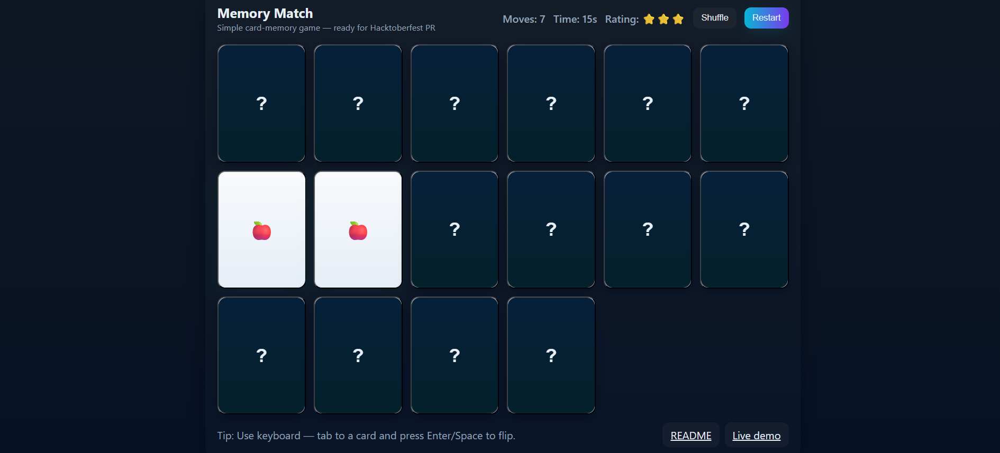

# Memory Match Game 🎴

A simple **Memory Match game** built with **HTML, CSS, and JavaScript**.  
Single-file, responsive, accessible, and ready for Hacktoberfest PR!

---

## Features
- Shuffle cards and match pairs
- Move counter, timer, and star rating
- Keyboard accessibility (Tab + Enter/Space)
- Win modal with game stats
- Restart / Shuffle buttons
- Small, responsive, and visually appealing

---

## How to Run Locally
1. Clone or download the repository.
2. Navigate to `games/memory-match/`.
3. Open `index.html` in a modern web browser.
4. Play the game locally — no build tools needed.

---

## Contributing
- Add new features or game variations
- Improve styling or accessibility
- Submit PRs with a **screenshot** of the game
- Follow Hacktoberfest rules for PRs

---

## Screenshot

---

## License
This project is licensed under the **MIT License**.
